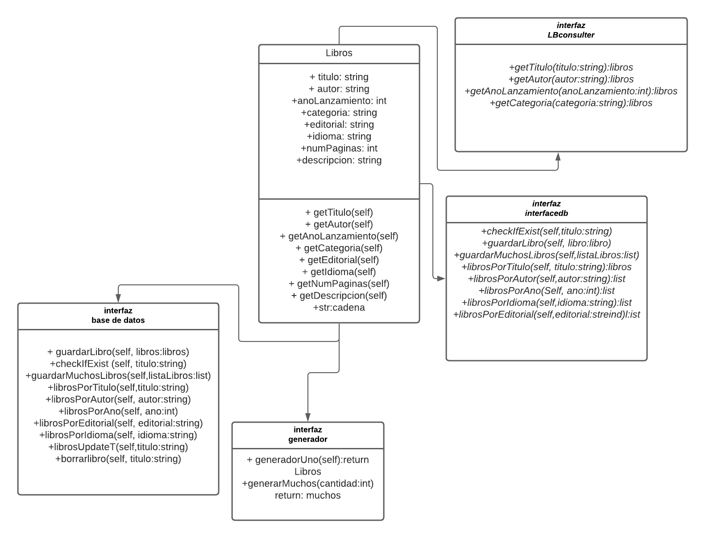

# DAS_Project

Implementación de Arquitectura Hexagonal para el desarrollo de softaware de una Librería, realizada
como proyecto final para la materia de Diseño y Arquitectura de Software.

# Como contribuir:
-Realizar fork del proyecto.

-Todos los Pull Request deben ir a la rama de desarrollo, la cual se llama development.

-Todas las subramas deben ser creadas en base a la rama development.

# Diagramas

Este pryecto fue realizado bajo la implementación de una arquitectutra de software, llamada Hexagonal
como la que es mostrada en la siguiente imagen: 

A continuación, se ilustrara el diagrama UML del proyecto: 

# Tecnologias utilizadas

El proyecto como tal, necesito la utilización de distintos tipos de tecnologías, desde la implementación 
de lenguajes de programación, interacción de base de datos, utilización de contenedores, partiendo de
una API. Todas las tecnología implementadas se encuentarn en el siguiente listado.

## Lenguajes

-python.

-shell.

## Framework

-flask.

## Base de datos

-Mongo DB.

## DBMS

-Mongo-express.

## Otras tecnologias

-docker.
-docker compose.

# Ejecución:

## Para lograr la ejecución de este proyecto es necesario que el dispositivo de computo tenga instalado `docker` y `docker compose`.

## Pasos a seguir
1. Realizar copia del repositorio a travéz del siguiente comando:<pre><code>git clone https://github.com/Hanhoeng/DAS_Project.git
</code></pre>

2. Ubicar en la carpeta base del repositorio y ejecutar el siguiente comando de docker compose::<pre><code>docker-compose up
</code></pre>
Nota: Si los contenedores son revisados con <pre><code>docker ps
</code></pre> se podra notar que solo estan los contenedores correspondientes a la base de datos, dbms y API ya que el contenedor con el generador se detiene una vez termine de guardar los libros falsos generados.

## Videos
- [Descargar video](https://drive.google.com/file/d/176ntSEO9cfQ1Lx-olHd3ECQCgAdprjJ-/view?usp=sharing)
- [Video en YouTube](https://www.youtube.com/watch?v=eFfRrLqC6u0)

Contibuyentes:
* [David Hiroshi Gloria Kawasaki](https://github.com/Hanhoeng)
* [Jose Fernando Perez Arroyo](https://github.com/FernandoPerez-ops)
* [Lucely Liliana Flores Escalante](https://github.com/LucelyFlores)
* [Brandon Emmanuel Delabra Salinas](https://github.com/Andremm303)
* [Cristian edgardo guerrero lopez](https://github.com/KryzHD)